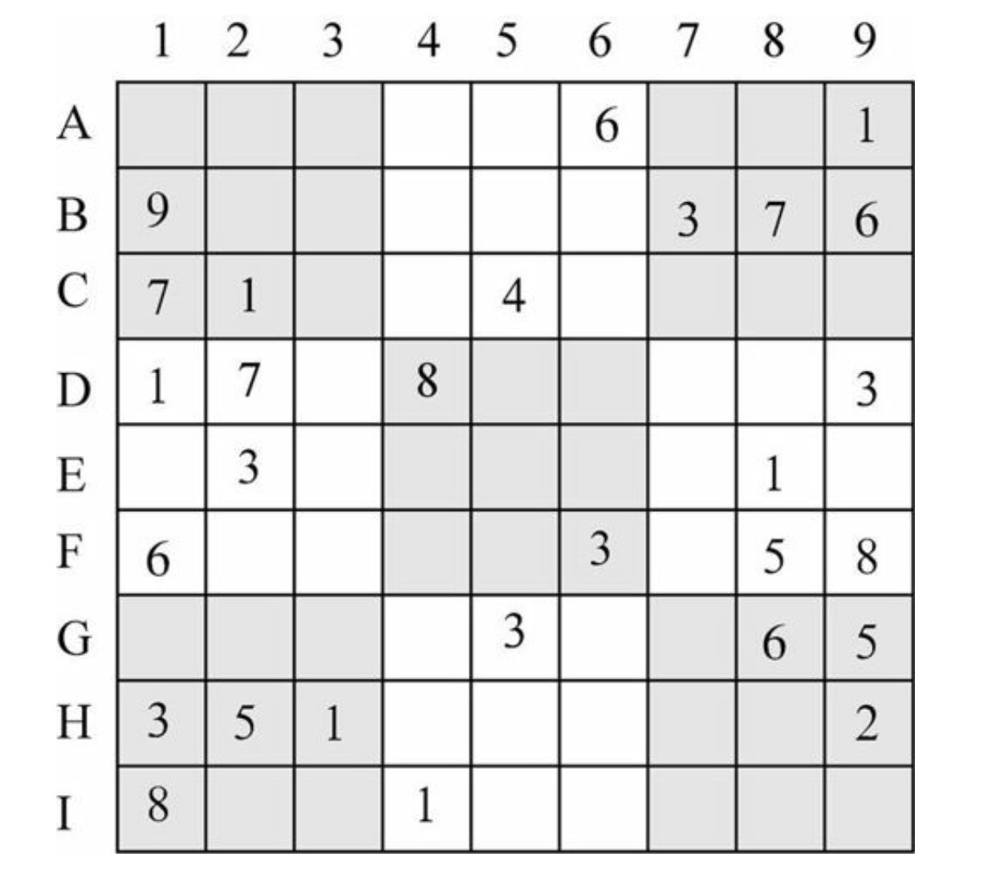

# Import message on plagiarism

The single most important point for you to realize before the beginning of your studies at ShanghaiTech is the meaning of "plagiarism":

> Plagiarism is the practice of taking someone else's work or ideas and passing them off as one's own. It is the misrepresentation of the work of another as your own. It is academic theft; a serious infraction of a University honor code, and the latter is your responsibility to uphold. Instances of plagiarism or any other cheating will be reported to the university leadership, and will have serious consequences. Avoiding any form of plagiarism is in your own interest. If you plagiarize and it is unveiled at a later stage only, it will not only reflect badly on the university, but also on your image/career opportunities.

Plagiarism is academic misconduct, and we take it very serious at ShanghaiTech. In the past we have had lots of problems related to plagiarism especially with newly arriving students, so it is important to get this right upfront:

**You may** ...

- ... discuss with your peers about course material.
- ... discuss generally about the programming language, some features, or abstract lines of code. As long as it is not directly related to any homework, but formulated in a general, abstract way, such discussion is acceptable.
- ... share test cases with each other.
- ... help each other with setting up the development environment, etc.

**You may not** ...

- ... read, possess, copy or submit the solution code of anyone else (including people outside this course or university)!
- ... receive direct help from someone else (i.e. a direct communication of some lines of code, no matter if it is visual, verbal, or written)!
- ... give direct help to someone else. Helping one of your peers by letting him read your code or communicating even just part of the solution in written or in verbal form will have equal consequences.
- ... gain access to another one’s account, no matter if with or without permission.
- ... give your account access to another student. It is your responsibility to keep your account safe, always log out, and choose a safe password. Do not just share access to your computer with other students without prior lock‐out and disabling of automatic login functionality. Do not just leave your computer on without a lock even if it is just for the sake of a 5‐minute break.
- ... work in teams. You may meet to discuss generally about the material, but any work on the homework is to be done individually and in privacy. Remember, you may not allow anyone to even just read your source code.

With the Internet, "paste", and "share" are easy operations. Don’t think that it is easy to hide and that we will not find you. We have just as easy to use, fully automatic and intelligent tools that will identify any potential cases of plagiarism. And do not think that being the original author will make any difference. Sharing an original solution with others is just as unethical as using so meone else’s work.

# CS100 Homework 2 (Spring 2023)

Deadline: 2023-03-08 (Wed) 23:59:59

Late submission will open for 24 hours after the deadline, with 50% point deduction.

If you get full marks in this assignment by no more than 40 submission attempts, you can earn special OJ displays and a "1-case protection" that can be used in further assignments to cancel one testcase failure. See Piazza or OJ dashboard for more information.

---

## Problem 1: Happy Coding

Given $n$ integers, output the square of positive numbers in reversed order.

### Input

The first line contains a non-negative integer $n$.

Then $n$ lines follow, the $i$-th line containing an integer $a_i$.

### Output

Your output should consist of $m+1$ lines, where $m$ is the number of positive numbers in $\left\{a_1,\cdots,a_n\right\}$. The first $m$ lines contain the square of positive numbers in reversed order, one for each line. Then print $m$ on the last line.

### Sample

#### Input

```
6
-1
100
-2
3
-3
12
```

#### Output

```
144
9
10000
3
```

### Notes

$1\leqslant n\leqslant 100$.

$-2^{31}\leqslant a_i\leqslant 2^{31}-1$ for every $i\in\{1,\cdots,n\}$

---

## Problem 2: Quadratic Equation

Solving a linear equation is too hard, so we will solve a quadratic equation. A quadratic equation is of the form $ax^2+bx+c=0$, where $a,b,c$ are constant real numbers and the unknown $x\in\mathbb R$.

Given the coefficients $a,b$ and $c$, your task is to solve the quadratic equation $ax^2+bx+c=0$.

To make the problem easier, $a$ **may be zero**. To make the problem harder, it is guaranteed that $a,b,c\in\mathbb Z$.

Solve the equation and output the solution(s).

- If the equation is a quadratic one, your output should be of one of the following forms (where `???` is replaced with the exact solution):
  - `x1 = x2 = ???`
  - `x1 = ???, x2 = ???` where $x_1<x_2$
  - `No solution.`
- Otherwise, your output should be of one of the following forms (where `???` is replaced with the exact solution):
  - `x = ???`
  - `No solution.`
  - `x\in\mathbb{R}`, indicating $x\in\mathbb R$ in $\LaTeX$

All the output numbers should be rounded to **three decimal places**.

It is guaranteed that $|a|,|b|,|c|\leqslant 100$.

### Samples

#### Sample 1

##### Input

```
1 2 1
```

##### Output

```
x1 = x2 = -1.000
```

#### Sample 2

##### Input

```
1 0 1
```

##### Output

```
No solution.
```

#### Sample 3

##### Input

```
0 0 0
```

##### Output

```
x\in\mathbb{R}
```

#### Sample 4

##### Input

```
1 3 2
```

##### Output

```
x1 = -2.000, x2 = -1.000
```

---

## Problem 3: Hexadecimal Calculator

You are given two integers $a$ and $b$ in hexadecimal representation. Your task is to perform addition $a+b$ or subtraction $a-b$ in hexadecimal using the vertical method (竖式).

### Input

Three lines in total.

The first line contains a character that is either `'+'` or `'-'`, which indicates the operation you need to perform.

The next two lines are the integers $a$ and $b$ respectively, in hexadecimal representation.

### Output

Show how you do the vertical addition/subtraction. Your output should be of one of the following forms:

- ```
    xxxxxxxx
  p    yyyy
  ---------
     zzzzzz
  ```
- ```
            xx
  pyyyyyyyy
  ---------
   zzzzzzzz
  ```
     where the `x`'s and `y`'s represent the input numbers $a$ and $b$, and `p` is either `+` or `-` depending on the input.

### Samples

#### Sample 1

##### Input

```
+
1ab
2c
```

##### Output

```
 1ab
+ 2c
----
 1d7
```

#### Sample 2

##### Input

```
-
abc
a12
```

##### Output

```
 abc
-a12
----
  aa
```

### Notes

Let $L(x)$ be the length of the hexadecimal representation (i.e. the number of digits required) of $x$. Let $r$ be the result (either $a+b$ or $a-b$). It is guaranteed that

- $a,b,r\geqslant 0$.
- $L(a),L(b)\leqslant 50$.
- $L(r)\leqslant\max\{L(a),L(b)\}$.
- The letters in the hexadecimal representations are all in lower-case.

---

## Problem 4: Bit Operation

### Background (You can skip this entire section)

In the year 1979, a young astronomer named Ye Wenjie is working on a project that aims to send radio signals to outer space in search of extraterrestrial intelligence. Ye Wenjie is a survivor of the Chinese Cultural Revolution, a period of political turmoil and violence that killed her father and traumatized her. She has lost faith in humanity and hopes to find a better civilization in the stars.

Ye Wenjie’s project is supported by a secret military base called Red Coast. The base has a powerful antenna that can transmit and receive signals from distant galaxies. Ye Wenjie uses the antenna to send messages to various star systems, hoping to get a response. She also receives messages from other human radio stations around the world.

One day, she receives a message from an unknown source that gives her a coding problem as a way of testing her intelligence and curiosity. The problem is in the discription.

Ye Wenjie solves the problem using her knowledge of binary arithmetic and sends her code back to the source. She thinks that by doing so she can establish contact with an alien civilization and learn more about their culture and technology. She doesn’t know that by doing so she has also invited a hostile invasion from a ruthless enemy…

### Description

In this problem, your task is to split a number into two parts by binary digits and reassemble them to form a new number.

You will recieve an unsigned integer $x$ whose binary representation consists of $n$ digits (You need to find $n$ on yourself!), and a non-negative integer $m$. First, you need to split out the rightmost $m+1$ digits to form an integer $p$, and the rest digits form an integer $q$. Then, place $p$ on the left of $q$ (in binary representation) to obtain a new number.

Formally, write $x$ as
$$
x=(x_{n-1}\dots x_1x_0)_{\text{two}}
$$
where $x_i\in\{0,1\}$ and $x_{n-1}=1$. Then
$$
p=(x_{m}\dots x_1x_0)_{\text{two}},\quad\text{and}\quad q=(x_{n-1}\dots x_{m+1})_{\text{two}}.
$$
The reassembled integer should be
$$
y=(x_{m}\dots x_1x_0x_{n-1}\dots x_{m+1})_{\text{two}}.
$$

Then, you need to calculate the "lowbit" of $y$. The "lowbit" of an integer $k=(k_{n-1}\dots k_1k_0)_{\text{two}}$ is the smallest index $t$ such that $k_t=1$.

For example, if $x=54=(110110)_{\text{two}}$ and $m=1$, $p$ should be $(10)_{\text{two}}$ and $q$ is $(1101)_{\text{two}}$ in binary representation. So the reassembled integer is $y=(101101)_{\text{two}}=45$. The "lowbit" of $y$ is $0$ since the rightmost bit of $y$ is $1$.

### Input

One line containing two integers $x$ and $m$, separated by a space.

### Output

Two integers $y$ and $b$ on the same line, separated by a space. $y$ is the reassembled integer (in decimal representation) and $b$ is the lowbit of $y$.

### Samples

#### Sample 1

##### Input

```
114514 4
```

##### Output

```
77306 1
```

#### Sample 2

##### Input

```
2333333 17
```

##### Output

```
3778904 3
```

### Notes

$0 < x \leqslant 2^{63}-1$

$0 \leqslant m\leqslant 61$

It is guaranteed that $m\leqslant n-2$.

---

## Problem 5: No-Horse Sudoku

"No-horse sudoku", as interesting as its name sounds (especially in Chinese), is a kind of irregular sudoku with new rules. In this problem, your goal is to judge whether a given board of "no-horse sudoku" is valid. 

### Rules


A regular sudoku has 3 rules:

- Every number should appear exactly once in a column.
- Every number should appear exactly once in a row.
- Every number should appear exactly once in a "palace" (any of the nine equally divided $3\times3$ regions).

For "no-horse sudoku", we have an additional rule related to a concept "horse step".

Similar to the rules of horses in chess, we define that <u>two grids share a "horse step" if they lie diagonally in a $2 \times 3$ or $3 \times 2$ rectangle</u> (The pair (E5, C4), for example).

Now here comes the additional rule:

- Any two grids sharing a "horse step" should not be filled in with the same number.

### Your Task

Write a program that reads in an entire sudoku board and judges whether the board is valid under the "no-horse sudoku" rules. The whole board is valid if and only if all the numbers in the grids are valid.

It is recommended that you implement such a function (or anything similar to this), which can help you make your code clear and readable.

```c
bool checkOneNumber(int (*board)[9], int row, int col);
```

- Brief: Judges whether the number in the grid `board[row][col]` is valid under the "no-horse sudoku" rules.
- Parameters:
  - `board`: a $9\times 9$ array representing the sudoku board
  - `row`: the row index of the target grid
  - `col`: the column index of the target grid
- Return value: `true` if the number in that grid is valid, `false` otherwise.

### Input:

$9$ lines, each line containing $9$ numbers separated by space, representing a row of the sudoku board. The $i$-th line of the input represents the $i$-th row (top to bottom) in the sudoku board.

### Output:

`1` or `0`. Output `1` if the board is valid, and `0` otherwise.

### Important Note

We will check whether you earned your score for this problem in a proper way. Some tricks may get you a high score on OJ, but it will be in vain in the end.