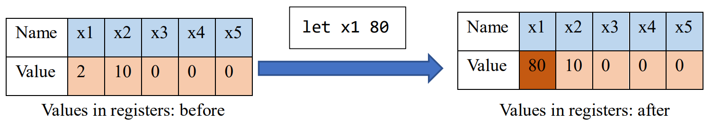

# Problem 5: CPU emulator

## Description

To understand how the computer executes your program, let me give a short introduction to CPU. The CPU basically contains 2 parts: [registers](https://en.wikipedia.org/wiki/Processor_register) and [ALU](https://en.wikipedia.org/wiki/Arithmetic_logic_unit). You can consider registers as an array. Each cell of this array has a name (for example, `x0`, `x1`, `x2`, $\dots$, `x31` in RISC-V), and can store a single number. Arithmetic calculations (addition, subscription, multiplication, division, ...) are done by ALU.

When executing your program, the assembly codes (written in binary) are sent to CPU. Each line of assembly code specifies some operation of registers, and CPU will use a special register named `PC` ([program counter](https://en.wikipedia.org/wiki/Program_counter)) to identify the current execution line number. For example, if the code is `add x3 x1 x2`, then CPU will take the values in registers `x1` and `x2`, add them up and store the result in the register `x3`. This is shown in the figure below (only 5 registers shown here). Then, the CPU increments `PC` by 1 to execute the next instruction.


In this problem, you are required to implement a toy emulator which is able to execute a very simple assembly language (similar to [RISC-V](https://en.wikipedia.org/wiki/RISC-V)). You only need to consider 6 registers, named `x0`, `x1`, `x2`, `x3`, `x4` and `x5`, all in lowercase, and each register stores a 16-bit integer. The `x0` register is a special one, whose value is **always zero**. Also, there are only has 6 instructions in this assembly language: `add`, `sub`, `mul`, `div`, `let` and `print`, which are introduced below.

In this problem, we use a 16-bit machine code. An example of a 16-bit instruction is as follows.


The instructions `add`, `sub`, `mul` and `div` are similar. The syntax is shown in the following table. Note that in these operations, the `imm` part is discarded.

| Instruction | Syntax      | Explanation                    | OpCode |
| ----------- | ----------- | ------------------------------ | ------ |
| `add`       | `add r1 r2` | value in `r1` += value in `r2` | `000`  |
| `sub`       | `sub r1 r2` | value in `r1` -= value in `r2` | `001`  |
| `mul`       | `mul r1 r2` | value in `r1` *= value in `r2` | `010`  |
| `div`       | `div r1 r2` | value in `r1` /= value in `r2` | `011`  |

The `let` instruction is used to assign value to a register. The syntax is:

| Instruction | Syntax       | Explanation           | OpCode |
| ----------- | ------------ | --------------------- | ------ |
| `let`       | `let r1 imm` | value in `r1` = `imm` | `100`  |

where `r1` is the name of some register (`x0` to `x5`), and `imm` is an integer within the range $\left[0,2^7-1\right]$. In this instruction, the `r2` part is discarded and the `imm` part is used. For example, the execution of instruction `let x1 80` is shown below.



Also, we need a `print` instruction to print the value in some register so that we can test whether the execution result is correct. For example, if the value in register `x1` is `5`, your emulator should print `x1 = 5` on the screen when the instruction `print x1` is executed. The `r2` part is also discarded in this instruction.

| Instruction | Syntax     | Explanation         | OpCode |
| ----------- | ---------- | ------------------- | ------ |
| `print`     | `print r1` | print value in `r1` | `101`  |

Notes:

1) In the `div` instruction, the division result is **truncated towards zero**, and the denominator will always be non-zero.
2) Value in all registers should be initialized to `0` before execution.
3) Remember that the value in `x0` is always zero. Any instruction that attempts to modify it should have no effect.
4) We only consider unsigned immediate in this problem.

## Input format

- The first line of the input is a number `n`, indicating the total lines of code. The following `n` lines are the instructions written in hexadecimal.

## Output format

- Your emulator should execute the input program, and only print the result when a `print` instruction is executed. It is guaranteed that the input and output are both non-empty.

## Example

Input:

```
2
0x8401
0xA400
```

Output:

```
x1 = 1
```

Explanation:

- `0x8401` is `1000010000000001` in binary, whose `opcode` is `100`, `r1` is `001` (`x1`), `r2` is `000` (`x0`) and `imm` is `0000001` (`1`). From the opcode we know that this is a `let` instruction, so the instruction is `let x1 1`.
- `0xA400` is `1010010000000000` in binary, whose `opcode` is `101` and `r1` is `001` (`x1`). This is a `print` instruction, so the instruction is `print x1`.
