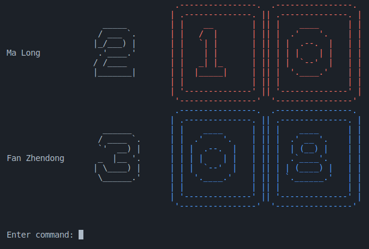

# Problem 3. Score board

请去 Piazza Resources 下载本题所需的文件。

很多竞技活动都需要使用**记分牌**，比如乒乓球和羽毛球。这类竞技活动通常有两个参与方，一个记分牌需要记录双方的得分。


本题中，我们研究如何实现一个电子记分牌。电子记分牌通常还能显示双方的姓名，有的还能显示俱乐部或队名信息。一个具有图形界面、支持鼠标操控的电子记分牌可能长这样：


注意，“记分牌”本身并不懂得任何比赛规则，它不会在某一方达到 11 分或者 21 分时宣布胜利。

由于图形界面相对比较复杂，本题中我们实现的是命令行界面的。我们已经将这个程序实现完毕，你可以编译运行 `attachments/main.cpp` 来看看效果，并且通过阅读这个文件中的代码来了解到如何操作这个记分牌。

## 下发的文件

首先介绍 `attachments` 中的各个文件。

- `ArtDigits.hpp` 包含了一些艺术字。这些艺术字是借助 [Python `art`](https://pypi.org/project/art/) 包来生成的。
- `CommandController.hpp` 包含一个简单的类 `CommandController` ，你应当可以通过阅读 `main.cpp` 来理解它的功能。
- `main.cpp` 是电子记分牌的主程序，包含了 `main` 函数。它通过 `CommandController` 接受用户的指令，并调用 `ScoreBoard` 的相关接口来更新分数、显示效果。
- `ScoreBoard.hpp` 包含了用来表示记分牌的 `ScoreBoard` 类的定义。
- `utils.hpp` 中包含一些特殊的函数，类似于 Homework 4 中的 `utils.h` 。
- `ScoreBoard_hint1.hpp` 和 `ScoreBoard_hint2.hpp` 见 [重构 `ScoreBoard.hpp`](#重构-scoreboardhpp)。

## 阅读 `utils.hpp`

`utils.hpp` 中包含的操作和先前 Homework 4 的 `utils.h` 里的操作是差不多的，但区别在于这次的 `utils.hpp` 采用了 C++ 的风格来编写。

`clear_to_eol` （第 83 行）是之前没有的函数，它会将当前光标所在的位置到该行末尾的内容清空。这个函数名中的 `eol` 是 end of line 的缩写。除了这个函数之外，其它函数在 Homework 4 的 `utils.h` 中都有。

### 颜色相关

第 93 到第 104 行定义了有关输出颜色控制的设施。

- `TextColor` 是一个**限定作用域的**枚举类型，因为它是由 `enum class` 而非 `enum` 定义的。它和一般的枚举类型的区别主要有二：
  1. 它不能和 `int` 相互隐式转换。可以看到，第 97 行中我们使用了 `static_cast<int>(color)` 来显式地将 `color` 转换为 `int` 。
  2. 该枚举类型的枚举项不能单独使用，需要带上类型名。可以看到，第 103 行中我们使用了 `TextColor::Normal` ，而不是直接使用 `Normal` 。
- 第 95 到第 99 行定义了一个输出颜色控制码的函数。它的使用方式非常简单，例如
  
  ```cpp
  std::cout << TextColor::Red << "hello" << TextColor::Blue << "world"
            << TextColor::Normal << std::flush;
  ```

  将会输出 `helloworld` ，其中 `hello` 是红色的， `world` 是蓝色的。
- 当我们以某种颜色输出了某些内容之后，一定要记得在最后输出 `TextColor::Normal` ，否则该颜色将继续被应用到后续的输出中。为此我们定义了 `ColorGuard` （第 101 到 104 行）类。

### 光标和输入的显示

在之前的 Pacman 中，整个游戏过程中我们都不需要显示光标和输入的内容，所以我们在程序刚开始的时候就（在 `prepare_game` 中）调用了 `hide_cursor` 和 `disable_input_echo` 来隐藏它们。

但是本题不同。有时我们需要画一些东西（比如展示数字滚动的动画），在这个过程中光标和输入应该被隐藏；而其它时候我们需要等待用户输入指令，这时我们要将光标和输入显示出来。

第 19 到第 69 行定义了 `PrinterGuard` 类，它在构造函数中隐藏光标和输入，在析构函数中恢复它们。注意，在某一时刻很可能会存在多个 `PrinterGuard` 对象：

```cpp
void printWidget(int which) {
  PrinterGuard printing;
  // 画一些东西 ...
}
void printGadget() {
  PrinterGuard printing;
  printWidget(1); // printWidget 还会创建一个 PrinterGuard 对象
  // 在这时，printWidget(1) 所创建的 PrinterGuard 对象被销毁
  // 我们必须保证现在的光标和输入显示仍然是隐藏状态
  printWidget(2);
  move_cursor(/* ... */);
  std::cout << someOtherStuff() << std::flush;
}
```

为此， `PrinterGuard` 使用一个静态成员 `numOfInstances` 来记录当前程序中 `PrinterGuard` 对象的个数。你可能发现了： `ColorGuard` 并无此设施，所以 `ColorGuard` 不支持这种情况。

`ScoreBoard.hpp` 的第 65、66 行展示了 `PrinterGuard` 和 `ColorGuard` 的一种使用方式。

## 阅读 `ScoreBoard.hpp`

这部分便是这个记分牌的核心。一个 `ScoreBoard` 记录了对战双方的名字 `mNames` 和他们当前的分数 `mScores` 。 `ScoreBoard` 的构造函数接受并存储双方的名字，将双方的分数初始化为零，然后打印出最初的界面。`ScoreBoard` 的析构函数会展示一个从下往上擦去的动画。

双方的名字似乎不需要存储，因为它们只在构造函数中被用到？这其实不一定。你大可以增加一个设定胜者的功能，将胜者的名字以鲜艳的颜色显示，或者带有闪烁等效果。

`ScoreBoard::printBlock` 函数（第 22 到第 30 行）需要简单解释一下，因为它涉及到模板。你可以在 `ScoreBoard` 的构造函数中看到对该函数的调用。 `printBlock(object, baseRow, baseCol)` 会以第 `baseRow` 行、第 `baseCol` 列为左上角画出 `object` ，其中 `object` 是一个任意大小的二维 `char` 数组。

`updateScore` 负责更新分数，并调用 `scrollDigit` 来显示动画。其中的细节需要你自行阅读和理解。

## 重构 `ScoreBoard.hpp`

可以看到，尽管这个 `ScoreBoard` 类已经实现了我们想要的各种功能，但是它的代码非常混乱，其中各个函数都充斥着计算位置、管理颜色、更新分数等功能。这些代码虽然在一个类中，但本质上仍然是**面向过程**的风格。

我们考虑对这个类进行重构。一个基本的想法就是将记分牌的各个部分分开，比如：

- 定义一个类 `DigitPad` 表示一个“数码牌”。它会记录自己的位置和当前的数字，并负责好自身的显示和动画功能。但是它并不知道任何与分数、对战方有关的信息。
- 定义一个类 `Player` 表示一个“对战方”。它会管理好一个对战方的名字、分数信息，并创建和管理两张数码牌。它提供和分数更新有关的接口，会根据分数更新要求来调用数码牌上的相关函数。
- `ScoreBoard` 含有两个 `Player` 。

`ScoreBoard_hint1.hpp` 体现的就是上述的设计。

注意，上述设计中认为一个“对战方”会创建两张数码牌。但是我们也可以认为一个“记分牌”本身就具有四张数码牌，这四张数码牌应该由记分牌本身创建和持有，而对战方只是**管理**数码牌。你还可以做得更多，比如再定义一个类 `NamePad` 表示一个“姓名牌”，负责记录这个姓名显示的位置，并支持打印姓名的功能，那么 `Player` 除了管理两张数码牌之外还需管理一张姓名牌。 `ScoreBoard_hint2.hpp` 体现了这种设计。

你可以选择在 `ScoreBoard_hint1.hpp` 或 `ScoreBoard_hint2.hpp` 的基础上进行重构。当然，如果你有其它想法，也可以自己实现。

由于画图的功能被移至许多个类当中，原来的 `ScoreBoard::printBlock` 函数不再是 `ScoreBoard` 的静态成员函数，而是被放在了全局的 `namespace detail` 之下，调用时需要加上 `detail::` 。这种将某些实现细节藏进名为 `detail` 的命名空间中的做法也是十分常见的。

注：我们并不是在说这样重构一定比重构前的代码更好。事实上，软件工程中从来不存在某一种永远是最好的设计，面向对象的设计也并非一定比面向过程的设计更好。本题的重点在于体会“重构”这一过程，比较多种不同的设计，理解类与类之间如何协作。

## 扩展记分牌的功能

一个组织得好的软件系统往往具有较好的灵活性，使我们很容易扩展其功能。而一个设计得不好的软件系统想要扩展功能则往往需要大动干戈。

现在，我们来尝试在重构后的代码上增加和修改一些功能。

1. 为双方各增加一个数字表示“局分”，并在 `ScoreBoard` 上增加一组修改局分的函数。当然，你还需要在 `main` 中增加相应的指令，这个指令你可以自己设计。效果如图：

   

2. 将双方的分数改为上下放置，姓名靠左对齐，效果如图：
   
   

你最终实现的效果可以是以上两者之一，或者其它同等难度的扩展。

## 评分

本题的评分采用线下 check 的方式。

- 重构但仅实现原有的功能，得 60 分。
- 重构并实现扩展的功能，得 100 分。但是如果你实现的扩展功能不是上一节中提到的两者之一，且难度显著较低，则会酌情扣分。

在此基础上，还有下列扣分项。

1. (50%) **未格式化。** 和 Homework 4 不同，这一次我们不会再给当场修改的机会。
2. (50%) **在 GCC13 或 GCC14 （`g++`）`-Wall -Wpedantic -Wextra` 的情况下有 warning 。** 和 Homework 4 不同，这一次我们不会再给当场修改的机会。
   - 注意，和 Homework 4 类似，这道题的程序也会在刚开始运行时清屏。所以如果你使用 IDE 提供的某些“一键编译运行”功能，你可能就看不见编译器报告的 warning 了。
   - 如果在你的电脑上没有 warning 但在助教的电脑上有，以你自己的电脑上的情况为准。但请务必确认你开启了 `-Wall -Wpedantic -Wextra` 选项。和 Homework 4 一样，我们不会在 OJ 上提供编译结果。
3. (10%) 尽可能使用构造函数初始值列表。事实上，如果你基于我们提供的两个 `hint` 文件之一进行重构，那么所有构造函数中的所有数据成员都应该在构造函数初始值列表中初始化，不存在无法这样初始化的情况。
4. (10%) 各个类和函数分工明确。
5. (10%) 变量应在即将使用时才被声明，特别是不应随意使用全局变量（常量除外）。

## 提交

将 `main.cpp` 和 `ScoreBoard.hpp` 打包为一个 zip 文件提交到 OJ ，其中 `ScoreBoard.hpp` 应该是你重构、扩展功能后的代码，并且它应该在 `main.cpp` 中被 `#include` 。当然，如果你做了一些更为复杂的重构，例如将代码分进了多个文件中，也请将这些文件打包进来。理论上 `ArtDigits.hpp` 、 `CommandController.hpp` 和 `utils.hpp` 应该不需要改动，但如果你改了，也请一并打包提交。

OJ 上只会检测你提交了哪些文件，并将它们打印出来，除此之外什么都不做。

## 广告

如果你有乒乓球基础，能每周按时参加训练，有意愿增进乒乓球技术并参加一些比赛，欢迎加入上海科技大学乒乓球校队。请联系 gongke@shanghaitech.edu.cn 。

前不久我们刚刚参加了上海市大学生乒乓球锦标赛，这是这道题的灵感来源。
