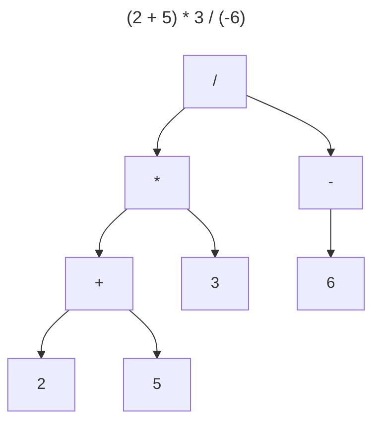
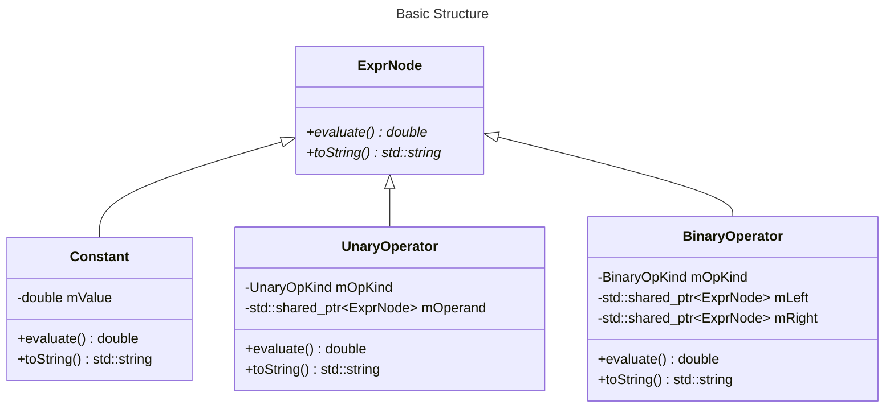
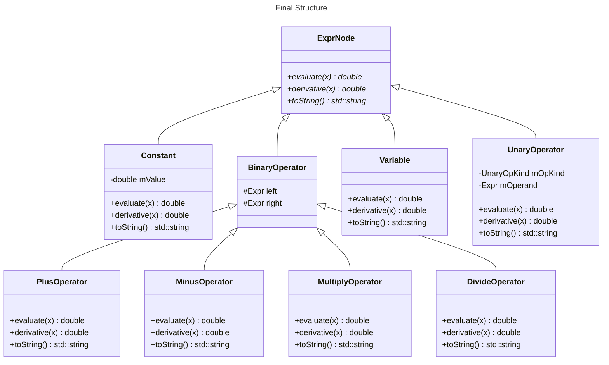

# Problem 1. Expression

Go to Piazza Resources to download the attached files.

## Background

In this problem, we deal with trees that represent arithmetic expressions. We first consider only the expressions consisting of numbers (constants), the unary `+` and `-` operators, and the binary `+`, `-`, `*` and `/` operators. Such expressions can be represented by a tree structure, which is named **expression trees** or **abstract syntax trees (AST)**. For example, the tree representing `(2 + 5) * 3 / (-6)` is



Such a tree is quite useful, as it contains the structure of all subexpressions. We may perform some operations on the tree recursively, such as printing, evaluation, conversion to some special forms, etc. Now your task is to build a class hierarchy representing these different kinds of nodes. Parsing an expression into an AST is beyond the scope of CS100.

## The basic structure

We start from the following basic structure.



Note: some functions should be declared virtual or pure virtual **(your task)**.

```cpp
class ExprNode {
public:
  // FIXME: Some of the functions below should be virtual or pure virtual.
  ExprNode() = default;
  double evaluate() const;
  std::string toString() const;
  ~ExprNode() = default;
};

class Constant : public ExprNode {
  double mValue;

public:
  explicit Constant(double value) : mValue{value} {}
  // TODO: evaluate() and toString() ...
};

enum class UnaryOpKind {
  UOK_Plus, UOK_Minus
};

class UnaryOperator : public ExprNode {
  UnaryOpKind mOpKind;
  std::shared_ptr<ExprNode> mOperand;

public:
  UnaryOperator(UnaryOpKind op, std::shared_ptr<ExprNode> operand)
      : mOpKind{op}, mOperand{std::move(operand)} {}
  // TODO: evaluate() and toString() ...
};

enum class BinaryOpKind {
  BOK_Plus, BOK_Minus, BOK_Mul, BOK_Div
};

class BinaryOperator : public ExprNode {
  BinaryOpKind mOpKind;
  std::shared_ptr<ExprNode> mLeft;
  std::shared_ptr<ExprNode> mRight;

public:
  BinaryOperator(BinaryOpKind op, std::shared_ptr<ExprNode> left, std::shared_ptr<ExprNode> right)
      : mOpKind{op}, mLeft{std::move(left)}, mRight{std::move(right)} {}
  // TODO: evaluate() and toString() ...
};
```

It seems to be a nice hierarchy, but how does the user create a node? The user has to write

```cpp
// To create a BinaryOperator statically:
BinaryOperator bo1(BinaryOpKind::BOK_Plus,
                   std::make_shared<Constant>(3),
                   std::make_shared<Constant>(4));

// To create a BinaryOperator dynamically:
auto bo2 = std::make_shared<BinaryOperator>(
               BinaryOpKind::BOK_Plus,
               std::make_shared<Constant>(3),
               std::make_shared<Constant>(4));
```

which involves creating the `shared_ptr`s manually. This is too ugly and inconvenient.

## A level of indirection

Here goes the so-called "Fundamental Theorem of Software Engineering":

> We can solve any problem by introducing an extra level of indirection.

Our problem is that the user still has to do memory management (even though smart pointers are used). Ideally, memory management should be part of our implementation details. The user should only care about the structure of the tree. For example, we expect the user to be able to create a node in the following way

```cpp
Expr bo('+', Expr(3), Expr(4));
```

or even more conveniently like

```cpp
auto bo = Expr(3) + Expr(4);
```

Clearly, the latter one can be supported with a simple overloaded operator as long as the former one is supported.

Let's consider defining the `Expr` class, which works as the level of indirection between the user and the specific node classes. The class `Expr` should encapsulate a `std::shared_ptr<ExprNode>` and hide everything related to memory management from the user. Moreover, `Expr` should also provide the interfaces like `evaluate()` and `toString()`.

```cpp
class Expr {
  std::shared_ptr<ExprNode> mNode;

  Expr(std::shared_ptr<ExprNode> ptr) : mNode{std::move(ptr)} {}

public:
  // To enable the usage like `Expr(3)`.
  // This constructor is not marked `explicit`.
  Expr(double value) : mNode{std::make_shared<Constant>(value)} {}
  auto toString() const { return mNode->toString(); }
  auto evaluate() const { return mNode->evaluate(); }

  // TODO: Some friend declarations might be necessary ...
};
```

Since `Expr` is a wrapper of a `std::shared_ptr<ExprNode>`, it should have a constructor that initializes that `shared_ptr` member. We make this constructor `private` because we don't want the user to call it directly.

Now let's think about what `Expr` actually does. It contains a smart pointer to some node class, and behaves very much like a node class because it has the interfaces `toString()` and `evaluate()`. Such a class that **represents an object of any node type perfectly** and **does memory management internally** is called a ***surrogate*** (代理) or a ***handle*** (句柄).

With this handle class defined, wherever a `std::shared_ptr<ExprNode>` is needed, a `Expr` can always work. The other node classes can simply replace every `std::shared_ptr<ExprNode>` with `Expr` and completely forget about how memory is managed:

```cpp
class UnaryOperator : public ExprNode {
  UnaryOpKind mOpKind;
  Expr mOperand;

public:
  UnaryOperator(UnaryOpKind op, Expr operand)
      : mOpKind{op}, mOperand{std::move(operand)} {}
  
  // TODO: evaluate and toString ...
};
```

The user may create a `UnaryOperator` node through the following overloaded operators:

```cpp
Expr operator-(const Expr &arg) {
  return {std::make_shared<UnaryOperator>(UnaryOpKind::UOK_Minus, arg)};
}
Expr operator+(const Expr &arg) {
  return {std::make_shared<UnaryOperator>(UnaryOpKind::UOK_Plus, arg)};
}
```

(What is `return {...}`? See [Appendix: Returning a *braced-init-list*](#returning-a-braced-init-list).)

For example,

```cpp
auto neg3 = -Expr(3);
```

## More functionalities

With basic knowledge on our class hierarchy obtained, you are going to add support for more functionalities:

- A new kind of node called `Variable`, which represents the varaible `x`. With this supported, our AST can be used to represent unary functions, instead of only arithmetic expressions with constants.
- Evaluation of the function at a certain point $x=x_0$.
- Evaluation of the derivative of the function at a certain point $x=x_0$.

The operations that need to be supported are declared in this base class:

```cpp
class ExprNode {
public:
  // FIXME: Make any of these functions virtual, or pure virtual, if necessary.
  ExprNode() = default;
  double evaluate(double x) const;   // Evaluate f(x)
  double derivative(double x) const; // Evaluate df(x)/dx
  std::string toString() const;      // Returns the parenthesized representation of the function.
  ~ExprNode() = default;
};
```

In the previous sections, we used only one class `BinaryOperator` to represent four different kinds of binary operators. Such design may not be convenient now, because the ways of evaluating the function and its derivative differ to a greater extent between different operators. Therefore, we separate them into four classes:

```cpp
class BinaryOperator : public ExprNode {
protected:
  Expr mLeft;
  Expr mRight;

public:
  BinaryOperator(Expr left, Expr right)
      : mLeft{std::move(left)}, mRight{std::move(right)} {}
};

class PlusOperator : public BinaryOperator {
public:
  using BinaryOperator::BinaryOperator;
  // TODO: evaluate(), derivative() and toString() ...
};

class MinusOperator : public BinaryOperator {
public:
  using BinaryOperator::BinaryOperator;
  // TODO: evaluate(), derivative() and toString() ...
};

class MultiplyOperator : public BinaryOperator {
public:
  using BinaryOperator::BinaryOperator;
  // TODO: evaluate(), derivative() and toString() ...
};

class DivideOperator : public BinaryOperator {
public:
  using BinaryOperator::BinaryOperator;
  // TODO: evaluate(), derivative() and toString() ...
};
```

(What is `using BinaryOperator::BinaryOperator;`? See [Appendix: Inheriting constructors](#inheriting-constructors).)

To support the variable `x`, we define a new class `Variable`:

```cpp
class Variable : public ExprNode {
  // TODO: evaluate(), derivative() and toString() ...
};
```

Then we define a `static` data member of `Expr` as follows.

```cpp
class Expr {
  std::shared_ptr<ExprNode> mNode;

  Expr(std::shared_ptr<ExprNode> ptr) : mNode{std::move(ptr)} {}

public:
  // This constructor should be defined after the class `Constant` is defined,
  // because creating an object of type `std::shared_ptr<T>` when `T` is incomplete
  // is not allowed.
  Expr(double value);

  static const Expr x;

  // Other members ...
};

// After the definition of the class `Variable`:
const Expr Expr::x{std::make_shared<Variable>()};
```

Note that `Expr` also has a non-`explicit` constructor that receives a `double` and creates a `Constant` node:

```cpp
// After the definition of the class `Constant`:
Expr::Expr(double value) : mNode{std::make_shared<Constant>(value)} {}
```

[Appendix: Unused parameters](#unused-parameters) may be of help when defining `Constant` and `Variable`.

The final structure is as follows.



With all of these and the overloaded arithmetic operators defined **(your task)**, we can create functions in a very convenient manner:

```cpp
auto &x = Expr::x;
auto f = x * x + 2 * x + 1; // x^2 + 2x + 1
std::cout << f.toString() << std::endl;
std::cout << f.evaluate(3) << std::endl;
std::cout << f.derivative(3) << std::endl;
auto g = f / (-x * x + x - 1); // (x^2 + 2x + 1)/(-x^2 + x - 1)
std::cout << g.evaluate(3) << std::endl;
std::cout << g.derivative(3) << std::endl;
```

The output should be

```
(((x) * (x)) + ((2.000000) * (x))) + (1.000000)
16
8
-2.28571
0.489796
```

## Requirements for `toString()`

Note: This is a very simple and naive way to convert an expression to a string, because we don't want to set barriers on this part. You can search for some algorithms to make the expression as simplified as possible, but it may not pass the OJ tests.

Any operand of the unary operators (`+`, `-`) or the binary operators (`+`, `-`, `*`, `/`) should be surrounded by a pair of parentheses. Correct examples:
- $2+3$: `(2.000000) + (3.000000)`
- $2x+3$: `((2.000000) * (x)) + (3.000000)`
- $2\cdot(-x)+3$: `((2.000000) * (-(x))) + (3.000000)`

Note: If the floating-point value of a `Constant` node is negative, it is **not** treated as a unary minus sign applied to its absolute value. For example,

```cpp
Expr e(-2);
std::cout << e.toString() << std::endl;
```

The output should be `-2.000000` instead of `-(2.000000)`.

There should be a space before and after each binary operator, e.g. `(expr1) + (expr2)` instead of `(expr1)+(expr2)`.

To convert a floating-point number to `std::string`, just use `std::to_string` and you will be free of troubles caused by precisions and floating-point errors.

`example.cpp` contains these simple tests.

## Requirements for `Expr`

From the user's perspective, only `Expr` and its arithmetic operators are **interfaces**. Anything else in your code is **implementation details**, which user code will not rely on. In other words, you are free to implement these things in any way, as long as the interfaces of `Expr` meet our requirements.

- `Expr` is copy-constructible, copy-assignable, move-constructible, move-assignable and destructible. These operations should just perform the corresponding operations on the member `mNode`, and let the corresponding function of `std::shared_ptr` handle everything. The move operations should be `noexcept`.
- `Expr` is constructible from a `double` value, and this constructor is non-`explicit`.
- Let `e` be of type `const Expr` and `x0` be of type `double`, then the subtree rooted at `e` represents a function.
  - `e.evaluate(x0)` returns the value of this function at $x=x_0$.
  - `e.derivative(x0)` returns the value of the derivative of this function at $x=x_0$.
  - `e.toString()` returns a `std::string` representing this function.
- Let `e1` and `e2` be two objects of type `const Expr`. The following expressions return an object of type `Expr`, which creates a new node corresponding to the operators.
  - `-e1`
  - `+e1`
  - `e1 + e2`
  - `e1 - e2`
  - `e1 * e2`
  - `e1 / e2`
- `Expr::x` is an object of type `const Expr`, which represents the variable `x`.

Use `compile_test.cpp` to check whether your code compiles. See [Appendix: Note on static assertion failure](#note-on-static-assertion-failure) for how to understand the error messages.

## Submission

Submit `expr.hpp` or its contents to OJ.

## Thinking

Why do we use `std::shared_ptr` instead of `std::unique_ptr`?

Can you add support for more functionalities, e.g. the elementary functions $\sin(e)$, $\cos(e)$, exponential expressions $e_1^{e_2}$, ...? More variables? Print expressions to $\LaTeX$?

# Appendix

## Returning a *braced-init-list*

In the following code

```cpp
class Expr {
  Expr(std::shared_ptr<ExprNode>);

  friend Expr operator-(const Expr &);
};
Expr operator-(const Expr &arg) {
  return {std::make_shared<UnaryOperator>(UnaryOpKind::UOK_Minus, arg)};
}
```

The return statement is equivalent to

```cpp
  return Expr{std::make_shared<UnaryOperator>(UnaryOpKind::UOK_Minus, arg)};
```

but **we don't want to repeat the return type in the return statement**.

Here we use a braced initializer list `{...}` to initialize the returned object (of type `Expr`). Since `Expr`

- is a non-aggregate class type, and
- does not have a constructor accepting `std::initializer_list`, and
- has a non-explicit constructor accepting `std::shared_ptr<ExprNode>`,

whatever written inside the pair of braces are passed to that constructor.

Detailed rules about **list-initialization** can be found [here](https://en.cppreference.com/w/cpp/language/list_initialization).

## Inheriting constructors

Given the following definition for `BinaryOperator`

```cpp
class BinaryOperator : public ExprNode {
protected:
  Expr mLeft;
  Expr mRight;

public:
  BinaryOperator(Expr left, Expr right)
      : mLeft{std::move(left)}, mRight{std::move(right)} {}
};
```

which has a constructor that accepts two `Expr`s and initializes `mLeft` and `mRight` with them respectively, the derived class `PlusOperator` can easily obtain a constructor that does the same thing by **inheriting** the constructor using a `using` declaration.

```cpp
class PlusOperator : public BinaryOperator {
  using BinaryOperator::BinaryOperator;
};
```

Now the user can create a `PlusOperator` object in the following way (suppose `e1` and `e2` are of type `Expr`):

```cpp
PlusOperator po(e1, e2);
```

Note that the access level of the inheriting constructor is always the same as that of the inherited constructor in the base class, no matter where the `using` declaration is placed.

Same things apply to `MinusOperator`, `MultiplyOperator` and `DivideOperator`.

## Note on static assertion failure

`compile_test.cpp` will test whether [the requirements for `Expr`](#requirements-for-expr) are satisfied, and will report errors using `static_assert`. This is also used on OJ.

If any requirement is not satisfied, an error will be reported like this:

```
compile_test.cpp:24:45: error: static assertion failed: Expect { e.evaluate(d) } -> double, with the setting (const Expr e, double d).
   24 |   static_assert(decltype(helper_##name(0))::value,                             \
      |                 ~~~~~~~~~~~~~~~~~~~~~~~~~~~~^~~~~
compile_test.cpp:31:1: note: in expansion of macro ‘EXPECT’
   31 | EXPECT(evaluate,   e.evaluate(d),   double)
      | ^~~~~~
```

The key message in this error is what goes after `static assertion failed`:

```
Expect { e.evaluate(d) } -> double, with the setting (const Expr e, double d).
```

It says that given `e` of type `const Expr` and `d` of type `double`, the expression `e.evaluate(d)` is expected to return `double`. This error message indicates that either `e.evaluate(d)` is not supported, or its return type is not `double`.

## Unused parameters

If a named parameter is not used in a function definition

```cpp
void foo(int x) {}
```

the compiler will generate a warning, which becomes an error with `-Werror`.

```
a.cpp: In function ‘void foo(int)’:
a.cpp:1:14: warning: unused parameter ‘x’ [-Wunused-parameter]
    1 | void foo(int x) {}
      |          ~~~~^
```

If you do want to declare an unused parameter (particularly in a virtual function), the most common way is to simply **omit the name of the parameter**:

```cpp
void foo(int /* unused */) {}
```

Note that we have seen this before: The overloaded postfix increment operator `++` has an unused parameter.

```cpp
class Iterator {
public:
  Iterator &operator++();
  Iterator operator++(int); // the postfix version
};
```

Another noticeable way to suppress warning on unused parameters/variables is to use [the `[[maybe_unused]]` attribute](https://en.cppreference.com/w/cpp/language/attributes/maybe_unused). However, we **don't** recommend using this attribute for things that are ***definitely*** unused. A parameter should be marked `[[maybe_unused]]` only when it ***may*** be unused:

```cpp
void skip([[maybe_unused]] const std::string &str, std::size_t &pos,
          [[maybe_unused]] char expect) {
  assert(str[pos] == expect);
  ++pos;
}
```

When the program is compiled with `-DNDEBUG` (i.e. with the macro `NDEBUG` defined), the `assert` will be removed, and `str` and `expect` will be unused.
