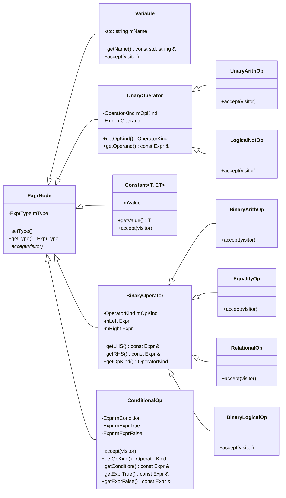
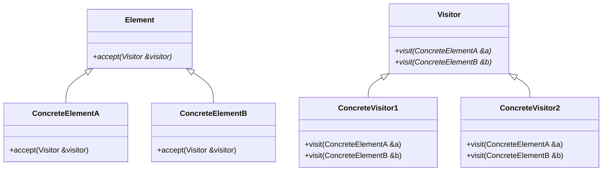

# Problem 2. Expression 2.0

请去 Piazza Resources 下载本题附带的文件。

在开始本题之前，请确保你已经完成了第一题，否则你可能无法看懂本题的代码。

本题虽然题目描述很长，下发的代码很多，但是实际上要写的内容不多，也比较简单。

## 背景

在第一题中，我们为简单的算术表达式的表达式树的结点类建立了一套继承体系，以便于我们轻松地创建表达式并执行一些数学计算。此类设施可能被用于像 [SymPy](https://www.sympy.org/en/index.html) 这样的符号计算库中。

在本题中，我们仍然研究类似的树结构，但是这一次我们处理的不是数学表达式，而是计算机程序中的表达式。我们也将为“表达式树”起一个新的名字：**抽象语法树** (Abstract Syntax Tree, AST) 。我们同样会为这棵树的各类结点创建一套类结构，这些设施可能会被用于一个编译器中， [Clang AST](https://clang.llvm.org/docs/IntroductionToTheClangAST.html) 就是一个例子。

请注意数学表达式和计算机程序中的表达式的根本区别。在本题中，

- 表达式的运算符更加多样。我们将会支持逻辑运算符 `!`, `&&`, `||` 、比较运算符 `<`, `<=`, `>`, `>=`, `==`, `!=` 和条件运算符 `?:` ，所支持的运算符的优先级和结合性和 C++ 中相同；
- 每一个表达式都具有一个**类型**。我们的类型系统包含三种类型：整数、浮点数、布尔。变量和常量的类型是在创建时就确定的，而其它子表达式的类型则需要根据相应的规则及其子表达式的类型计算得出。这也是你在本题中需要实现的部分，详见 [`type_check.hpp`](#type_checkhpp) ；
- 我们不再关注表达式的值，不会对表达式进行求导；
- 我们不再提供像第一题中的那些重载运算符和 `Expr::Expr(double)` 构造函数来创建结点。创建结点的方式是调用模板函数 `Expr::create` ，或者直接调用 `parse` 解析以字符串形式给出的表达式（详见 [`parse`](#parse)）；
- 我们不再研究如何打印“表达式”，而是研究如何打印“树”的结构，详见 [`ExprNodeVisitor` 和 `dump.hpp`](#exprnodevisitor-和-dumphpp) 。

## 下发的文件

`attachments` 中的文件结构如下。

```
.
└── attachments/
    ├── visitor_pattern/
    │   ├── cars.cpp
    │   └── shapes.cpp
    ├── dump.hpp
    ├── example.cpp
    ├── expr.hpp
    ├── parse.cpp
    ├── parse.hpp
    └── type_check.hpp
```

你最终的提交只包含 `type_check.hpp` 。如果你修改了其它文件中的代码，请不要让你的 `type_check.hpp` 依赖于那些改动。

OJ 上会提供 `expr.hpp` ，为了测试，会和 `attachments` 中的版本有细微的区别。理论上这种区别不会产生影响，但如果你确信你的代码无法通过测试是由它所致，请联系 TA 。

## `expr.hpp`

如果你已经完成了第一题，那么本题的 `expr.hpp` 中的大部分代码应该不难看懂。

首先， `ExprType` 是一个枚举类，其枚举项 `Integer`, `Float` 和 `Boolean` 分别表示整数、浮点数和布尔三种类型。 `Unevaluated` 表示该类型还未被计算， `ErrorType` 表示类型错误。初始状态下（即结点刚被创建时），变量和常量的类型是确定的，而其它结点的类型都是 `Unevaluated` 的。

结点类的继承体系如图所示：



一些值得注意的点：

- `Variable` 表示一个变量， `mName` 是这个变量的名字。 `Variable` 的类型是在创建之时就指定了的，因为 `Variable` 的构造函数要求传入一个 `ExprType` 参数。
- 常量有三种，分别是整数常量 `IntegerConstant` 、浮点数常量 `FloatConstant` 和布尔常量 `BooleanConstant` ，这三个类型实际上是统一由一个模板类 `Constant<T, ET>` 定义的，它们分别是 `Constant<int, ExprType::Integer>` 、 `Constant<double, ExprType::Float>` 和 `Constant<bool, ExprType::Boolean>` 的别名。
- 各类运算符结点类所表示的运算符都可以从代码中看出。例如， `UnaryArithOp` 的构造函数中有一个断言 `assert(op == OperatorKind::UnaryPlus || op == OperatorKind::UnaryMinus);` ，这表明 `UnaryArithOp` 所表示的运算符是一元正号或者一元负号。
- 每一个结点类都有相应的 getters 来返回它所保存的各种信息，例如 `Variable` 有 `getName()` ， `BinaryOperator` 有 `getLHS()` 和 `getRHS()` ，各类运算符都有 `getOpKind()` 。但是这些 getters 返回的都是不可修改的东西，也就是说我们不希望用户在创建好一棵树之后去改变其中的结构。
- 每一个**具体类**，即处在继承树的**叶子**位置的类，都 override 了 `accept` 函数。这一组 `accept` 函数是**访问者模式** (Visitor Pattern) 的一部分，详见[访问者模式 (Visitor Pattern)](#访问者模式-visitor-pattern) 。

和第一题不同，我们不再提供一组重载运算符来创建结点， `Expr` 类也没有接受 `double` 的构造函数来创建常量结点。你可以调用结点类的构造函数来创建结点，但是想要创建 `Expr` 就必须要调用模板函数 `Expr::create` ，例如

```cpp
auto three = Expr::create<IntegerConstant>(3);
auto pi = Expr::create<FloatConstant>(3.14);
auto sum = Expr::create<BinaryArithOp>(OperatorKind::BinaryPlus, three, pi);
```

对于一个结点类 `T` ， `Expr::create<T>(args...)` 会将参数 `args...` **完美转发**给 `std::make_shared<T>` 来创建一个 `std::shared_ptr<T>` ，然后用这个 `std::shared_ptr<T>` 经过 `Expr` 的那个私有构造函数去初始化一个 `Expr` ，也就是将它移入这个 `Expr` 对象的 `mNode` 。我们应该向 `Expr::create<T>` 传递什么参数？答案自然是看 `T` 的构造函数接受什么参数，因为 `std::make_shared<T>` 会把这些参数转发给 `T` 的构造函数。

需要说明的是，我们对于变量 `Variable` 的处理是比较粗糙的，这是因为我们没有提供变量声明、查找等机制。例如，下面的代码看似建模了表达式 `x < x + 1` ，但实际上 `<` 两侧的变量 `x` 并不是同一个变量：

```cpp
auto e1 = Expr::create<RelationalOp>(
    OperatorKind::Less,
    Expr::create<Variable>(ExprType::Float, "x"),
    Expr::create<BinaryArithOp>(OperatorKind::BinaryPlus,
                                Expr::create<Variable>(ExprType::Float, "x"),
                                Expr::create<IntegerConstant>(1)));
```

要想让两个 `x` 是同一个变量，得这样写：

```cpp
auto x = Expr::create<Variable>(ExprType::Float, "x");
auto e2 = Expr::create<RelationalOp>(
    OperatorKind::Less,
    x,
    Expr::create<BinaryArithOp>(OperatorKind::BinaryPlus,
                                x,
                                Expr::create<IntegerConstant>(1)));
```

好在我们暂时并不关心这些变量是不是同一个变量，因为我们不需要对这些表达式求值，这些变量的名字其实也并不重要。

总是要写这么一大堆 `Expr::create` 是不是很烦人？你也可以调用 `parse` 函数，详见 [`parse`](#parse) 一节。

`ExprNodeVisitor` 的解释见下文。

## 访问者模式 (Visitor Pattern)

第一题中，我们在结点类上定义了三组虚函数 `evaluate`, `derivative` 和 `toString` 来实现三种操作，这三种操作都需要递归地遍历整棵树，并且在不同结点上的实现可能不同。这样做看起来不错，但是——每当我们想添加一种操作时，我们都需要修改这些结点类的代码，定义一组新的虚函数。当这个继承体系变得复杂起来，可支持的操作也更加丰富时，这种做法灵活性低的问题就凸显出来了。

我们采用**访问者模式** (Visitor Pattern) 来解决这个问题。访问者模式是一种**设计模式** (Design Patterns) 。如果你想获得关于设计模式的一些基本的认识，我们强烈推荐[这个视频](https://www.bilibili.com/video/BV1ha411k7pa?p=51)。

访问者模式的基本框架如下图。



其中， `Element` 、 `ConcreteElementA` 和 `ConcreteElementB` 是原有的类结构，它们被称为***元素***，在我们的例子中它们就是 `ExprNode` 及各种继承自它的结点类。 `Visitor` 是**访问者**基类，它为每一种具体的元素定义一个 `visit` 函数，来完成在“访问”每种具体的元素时要做的事。 `ConcreteVisitor1` 和 `ConcreteVisitor2` 是两种具体的访问者，代表两类具体的操作，它们分别实现各个 `visit` 函数来完成相应的操作。

你可以在 `attachments/visitor_pattern` 中看到一些例子，其中 `cars.cpp` 是 [wikipedia 的 Visitor Pattern 词条](https://en.wikipedia.org/wiki/Visitor_pattern#)中的一份 Java 代码示例的 C++ 版本。

当我们想要支持一个新的操作时，只需定义一个新的访问者类，实现它的各个 `visit` 函数即可，无需修改元素本身的定义，无需像原来那样为元素添加虚函数。

## `ExprNodeVisitor` 和 `dump.hpp`

`ExprNodeVisitor` 定义在 `expr.hpp` 中，是我们的结点类的访问者基类，它为每一个具体的结点类（也就是说，不包含 `UnaryOperator` 和 `BinaryOperator` 这两个中间类）声明了一个 `visit` 纯虚函数。你将会需要定义一个继承自 `ExprNodeVisitor` 的类，实现这些虚函数来完成一些工作，具体要求见 [`type_check.hpp`](#type_checkhpp) 。

注意，一种设计模式在实践时并不是一成不变的，需要根据实际问题的复杂性进行调整。本例中的以下三点设计是值得讨论的：

- 基类 `ExprNodeVisitor` 的各个 `visit` 函数都是纯虚的，也就是说，没有默认行为。
- 结点类的 `accept(visitor)` 函数只会调用 `visitor.visit(*this)` ，不会对它的孩子调用 `accept` 。也就是说，对于子结点的递归的遍历需要在 visitor 的 `visit` 函数中完成，**例如在 `visit(UnaryArithOp &u)` 中，你可能需要调用 `u.getOperand().accept(*this)`** 。
- 我们没有为 `UnaryOperator` 和 `BinaryOperator` 这样的中间类提供 `visit` 函数。

像 [`clang::RecursiveASTVisitor`](https://clang.llvm.org/doxygen/classclang_1_1RecursiveASTVisitor.html) 这样复杂的“访问者”，不仅为所有结点类都提供了一组 `VisitXXX` 函数来实现“访问”，还有一组 `TraverseXXX` 函数来实现“遍历”，以及一组 `WalkUpFromXXX` 函数来处理父类。

`dump.hpp` 定义了 `dump` 函数来优美地打印一棵树的结构，例如 `x < 2 && y + 3 == 5` 对应的抽象语法树会被 `dump` 打印为

```
BinaryLogicalOp '&&' : Boolean
|-RelationalOp '<' : Boolean
| |-Variable 'x' : Float
| `-IntegerConstant 2
`-EqualityOp '==' : Boolean
  |-BinaryArithOp '+' : Float
  | |-Variable 'y' : Float
  | `-IntegerConstant 3
  `-IntegerConstant 5
```

当然，以上内容中的类型 `Boolean` 、 `Float` 等在未完成类型检查时都是 `Unevaluated` 。

`dump` 函数是借助一个名为 `DumpVisitor` 的访问者实现的，你可以阅读其中的代码来看看如何编写一个访问者。这份代码中涉及到一些花哨的技术，包括可变参数模板和成员指针。你不必看懂这里的每一个细节，只需大致知道每个 `visit` 函数要做什么即可。

## `type_check.hpp`

这是你需要实现的部分：**类型检查** (type checking) 。

和字面意思不同，类型检查并不只是“检查”，而是**计算**出这个表达式的各个部分的类型。 `ExprNode` 和 `Expr` 都有 `getType` 和 `setType` 接口，可以用来读取和设置一个结点的类型。

类型检查的规则如下。其中， `e` 、 `f` 和 `g` 都是表达式，其类型分别为 $E$ 、 $F$ 和 $G$ 。

| 表达式 | 要求 | 类型 |
|-|-|-|
| `!e` | $E=\mathtt{Boolean}$ | $\mathtt{Boolean}$ |
| `+e`, `-e` | $E\in\{\mathtt{Integer},\mathtt{Float}\}$ | $E$ |
| `e * f`, `e / f`,<br> `e + f`, `e - f` | $E,F\in\{\mathtt{Integer},\mathtt{Float}\}$ | 若 $E=F=\mathtt{Integer}$ ，则为 $\mathtt{Integer}$<br>否则为 $\mathtt{Float}$ |
| `e < f`, `e <= f`,<br> `e > f`, `e >= f` | $E,F\in\{\mathtt{Integer},\mathtt{Float}\}$ | $\mathtt{Boolean}$ |
| `e == f`, `e != f` | $E=F$ | $\mathtt{Boolean}$ |
| `e == f`, `e != f` | $E,F\in\{\mathtt{Integer},\mathtt{Float}\}$ | $\mathtt{Boolean}$ |
| `e && f`, `e \|\| f` | $E=F=\mathtt{Boolean}$ | $\mathtt{Boolean}$ |
| `e ? f : g` | $E=\mathtt{Boolean},$<br>$F=G$ | $F$ |
| `e ? f : g` | $E=\mathtt{Boolean},$<br>$F,G\in\{\mathtt{Integer},\mathtt{Float}\}$ | 若 $E=F=\mathtt{Integer}$ ，则为 $\mathtt{Integer}$<br>否则为 $\mathtt{Float}$ |

如果一个表达式不能匹配上表中的任何一条（即，相应的要求无法满足），则其类型为 $\mathtt{ErrorType}$ 。如果一个表达式包含一个类型为 $\mathtt{ErrorType}$ 的子表达式，则这个表达式的类型为 $\mathtt{ErrorType}$ 。

注意，你需要为**所有子表达式**都进行类型检查。例如对于 `e + f` ，即便你已经发现 `e` 的类型是 $\mathtt{ErrorType}$ ，你也不能跳过对 `f` 的类型检查。

编译运行 `example.cpp` 来进行简单的测试。其中，第 39 到 48 行所处理的表达式是通过 `parse` 来创建的，但 `parse` 函数的编译比较特殊。如果你还不知道怎么编译它（见下文），你可以先把这几行注释掉。

## `parse`

头文件 `parse.hpp` 中定义了 `parse` 函数以及一些辅助类。

```cpp
Expr parse(std::string_view exprCode,
           const std::unordered_map<std::string_view, ExprType> &varTypes = {});
```

`parse` 接受一个以字符串形式给出的表达式，它会解析这个字符串并创建出与之对应的抽象语法树。例如，

```cpp
auto g = parse("(x + 1 >= y * 2 - x ? true : x > 0) == false");
typeCheck(g);
dump(g);
```

将会打印出

```
EqualityOp '==' : Boolean
|-ConditionalOp '?:' : Boolean
| |-RelationalOp '>=' : Boolean
| | |-BinaryArithOp '+' : Float
| | | |-Variable 'x' : Float
| | | `-IntegerConstant 1
| | `-BinaryArithOp '-' : Float
| |   |-BinaryArithOp '*' : Float
| |   | |-Variable 'y' : Float
| |   | `-IntegerConstant 2
| |   `-Variable 'x' : Float
| |-BooleanConstant true
| `-RelationalOp '>' : Boolean
|   |-Variable 'x' : Float
|   `-IntegerConstant 0
`-BooleanConstant false
```

`parse` 的第二个参数是一个从变量名到类型的映射关系。例如，

```cpp
auto h = parse("x < y && z", {{"x", ExprType::Integer},
                              {"z", ExprType::Boolean}});
```

这就意味着 `x` 的类型是 $\mathtt{Integer}$ ， `z` 的类型是 $\mathtt{Boolean}$ 。未在这个参数里指出的变量的类型都是 $\mathtt{Float}$ 。

关键问题是：怎么编译？你可能已经发现了， `parse.hpp` 中有相当多的函数只有声明、没有定义。 `parse.cpp` 包含这些函数的定义，但是和我们之前写过的 `.cpp` 文件不同——它不含 `main` 函数。一种简单的编译方式就是

```sh
g++ example.cpp parse.cpp -o example -std=c++17 -Wall -Wpedantic -Wextra
```

即，同时向 `g++` 传递两个文件 `example.cpp` 和 `parse.cpp` ，这样编译器就能看到那些函数的定义了。

事实上，我们是可以单独编译 `parse.cpp` ，单独编译 `example.cpp` ，然后再将它们链接起来的。当编译器看到诸如 `fun(x)` 的函数调用时，它只需要能看见 `fun` 的声明，便能知道这个调用是否合法，并为这个函数调用生成相应的代码。至于 `fun` 的定义，那是链接器需要的东西。在 Linux/Mac 上，我们可以

```sh
g++ -shared parse.cpp -fPIC -o libparse.so
```

这样单独编译 `parse.cpp` 并生成动态链接库文件 `libparse.so` ，然后

```sh
g++ example.cpp -o example -Wl,-rpath . -L. -lparse
```

这样编译 `example.cpp` ，并将它与 `libparse.so` 动态链接。现在运行 `example` ，它就能够链接到 `libparse.so` 中的函数定义。有趣的是，如果我们现在对 `parse.cpp` 做一些改动，比如让 `doParse()` 直接抛出异常，然后再次编译生成 `libparse.so` ，那么直接重新运行 `example` ，你就会看到异常被抛出——无需重新编译 `example.cpp` 。类似的玩法在 Windows 上也是可以的，可以参考[这篇文章](https://www.transmissionzero.co.uk/computing/building-dlls-with-mingw/)。

这种分离式编译是很有用的。想象一下，在一个巨大的项目中，整个项目编译一次可能需要半个小时——这并不夸张，像 GCC 这样的项目就是。如果我只是改动了某个文件里的某两个函数的定义，却需要将整个项目重新编译一遍，这当然是不可接受的。

当然，一个复杂的项目可能包含成百上千个文件，要手动地编译各个文件是不现实的，这就需要借助一些自动化的工具了。在下一次作业中，我们会使用一个著名的工具—— CMake 来完成项目的构建。

## 提交

将 `type_check.hpp` 的内容提交到 OJ 。
